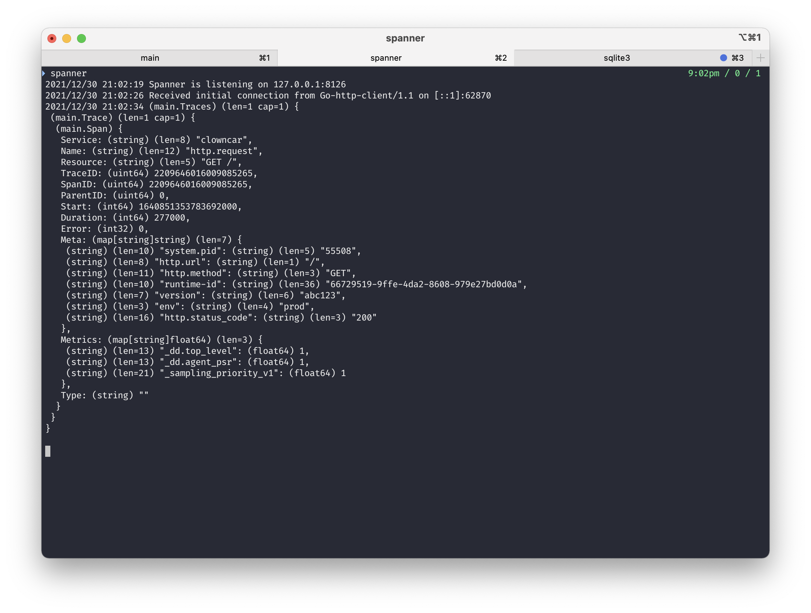

# Spanner

> A minimal tool for visualising Datadog traces 🔧

## Installation

You can install Spanner like so:

```shell
go install github.com/marcus-crane/spanner@latest
```

If you prefer Homebrew, you can use that as well:

```shell
brew tap marcus-crane/tap
brew install spanner
```

## Usage

Upon running `spanner`, it will start listening on `localhost:8126` for any requests.

When starting up one (or more) local applications with the Datadog tracer, they should default to localhost and you'll see the contents of the incoming traces dumped out to the terminal.

It isn't very pretty at the moment but it works as a first cut.

## Notes

It might also work with generic Opentracing spans but I haven't tried. I've also only implemented the [msgpack](https://github.com/vmihailenco/msgpack) format for traces but the [official agent](https://github.com/datadog/datadog-agent) also supports protobuf.

In my brief testing, only with the Go tracer, I didn't see any spans that weren't msgpack but it could vary between APM agents.

## Screenshots


